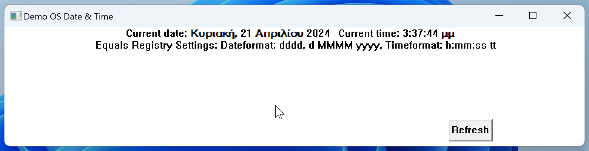
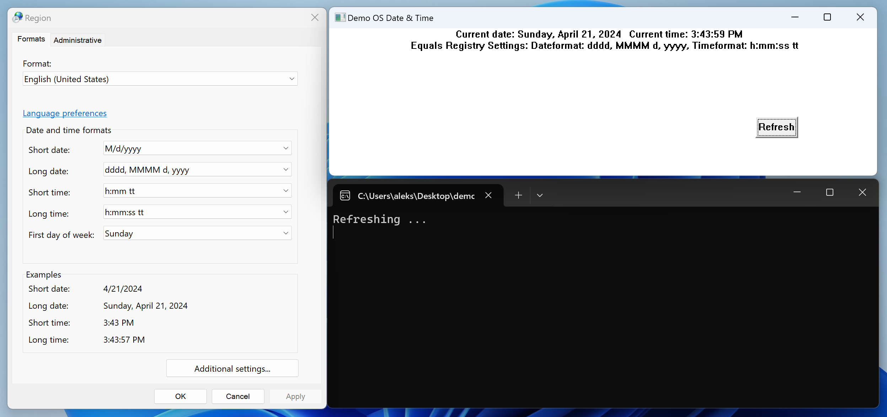

First time using rust

Simple Application that uses the windows api to get the current date and time in user specified 
locale format and outputs it inside a window with a refresh button.

Language:
Rust

Used crates:
chrono
registry
wchar
winapi
once_cell

Pictures:

